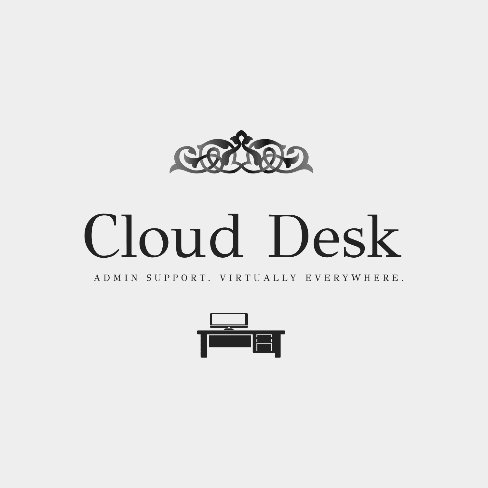

# Cloud Desk - Virtual Administrative Support for SMEs



Cloud Desk is a modern web application that connects small and medium-sized enterprises (SMEs) with professional virtual administrative support services. Our platform offers a comprehensive suite of remote assistance solutions at a fraction of the cost of hiring full-time staff.

## 🌟 Key Features

- **Virtual Assistant Support**: Email management, calendar organization, and personal task management
- **Customer Service**: Handle inquiries, update CRM systems, and manage client communications
- **Bookkeeping & Finance**: Invoicing, expense tracking, and financial report preparation
- **Admin & Data Entry**: Document formatting, database updates, and spreadsheet management
- **Project Coordination**: Task tracking, deadline reminders, and project support
- **Digital Presence**: Social media scheduling, online reputation monitoring, and content curation

## 🚀 Tech Stack

- **Frontend**: React 18 with TypeScript
- **Styling**: Tailwind CSS with custom animations
- **Animation**: Framer Motion for smooth transitions
- **Routing**: React Router DOM
- **Icons**: Lucide React
- **Build Tool**: Vite

## 🛠️ Development Setup

1. Clone the repository:
```bash
git clone https://github.com/yourusername/cloud-desk.git
cd cloud-desk
```

2. Install dependencies:
```bash
npm install
```

3. Start the development server:
```bash
npm run dev
```

4. Build for production:
```bash
npm run build
```

## 📦 Available Scripts

- `npm run dev` - Start development server
- `npm run build` - Build for production
- `npm run lint` - Run ESLint
- `npm run preview` - Preview production build

## 🎨 Design Features

- Modern, responsive design
- Smooth page transitions
- Interactive service cards
- Gradient backgrounds
- Custom animations
- Accessibility considerations

## 📱 Pages

- Home
- Services
- Individual Service Details
- Pricing
- About
- Contact

## 🤝 Contributing

We welcome contributions! Please feel free to submit a Pull Request.

## 📄 License

This project is licensed under the MIT License - see the LICENSE file for details.

## 📞 Contact

For any inquiries, please visit our [Contact Page](https://clouddesk.com/contact).
